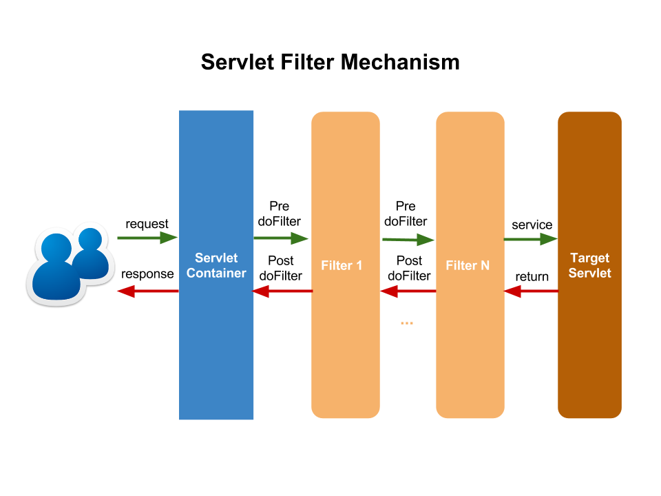
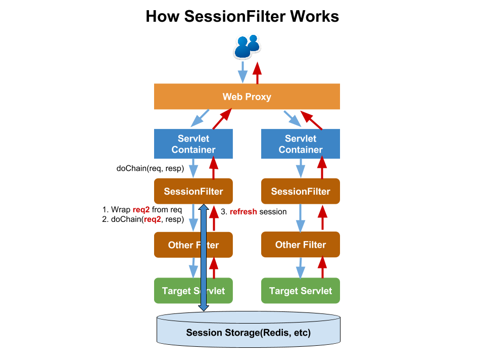

# Session

轻量的分布式会话组件(A Lightweight Distribute Session Component)
---

+ 包引入(maven dependency):
	
	```xml
	<dependency>
        <groupId>me.hao0</groupId>
        <artifactId>session-redis</artifactId>
        <version>1.0.0</version>
    </dependency>
	```
	
+ 依赖包，注意引入项目时是否需要排除(exclude if necessary):

	```xml
	<dependency>
        <groupId>me.hao0</groupId>
        <artifactId>session-api</artifactId>
        <version>1.0.0</version>
    </dependency>
    <dependency>
        <groupId>redis.clients</groupId>
        <artifactId>jedis</artifactId>
        <version>2.7.2</version>
    </dependency>
	
	```

+ Servlet-Filter机制(Mechanism)
	
	

+ SessionFilter如何工作(How SessionFilter Works):
	
	
		
+ 使用(Usage):
	
	+ 在**web.xml**中配置Filter(Config Filter in **web.xml**):

		```xml
		<filter>
	        <filter-name>RedisSessionFilter</filter-name>
	        <filter-class>me.hao0.session.redis.RedisSessionFilter</filter-class>
	        <init-param>
	        	  <!-- cookie中的sessionId名称 -->
	        	  <!-- the session id in cookie -->
	            <param-name>sessionCookieName</param-name>
	            <param-value>scn</param-value>
	        </init-param>
	        <init-param>
	        	  <!-- session过期时间(秒) -->
	        	  <!-- session expired time in seconds -->
	            <param-name>maxInactiveInterval</param-name>
	            <param-value>1800</param-value>
	        </init-param>
	        <init-param>
	        	  <!-- cookie上下文路径 -->
	        	  <!-- cookie context path -->
	            <param-name>cookieContextPath</param-name>
	            <param-value>/</param-value>
	        </init-param>
	        <init-param>
	        	  <!-- cookie域名 -->
	        	  <!-- cookie domain -->
	            <param-name>cookieDomain</param-name>
	            <param-value>session.com</param-value>
	        </init-param>
	        <init-param>
	        	  <!-- cookie保存时间(秒) -->
	        	  <!-- cookie lifetime in seconds -->
	            <param-name>cookieMaxAge</param-name>
	            <param-value>1800</param-value>
	        </init-param>
    </filter>
    <filter-mapping>
	        <filter-name>RedisSessionFilter</filter-name>
	        <url-pattern>/*</url-pattern>
    </filter-mapping>
		```
	+ 在**classpath**下配置**session.properties**(Config **session.properties** in **classpath**)
	
		```ruby
		# redis model: is sentinel or not, default is not sentinel
		# session.redis.mode=	
		
		# session serialize class, default is JsonSerializer
		# session.serializer=
		
		# redis host
		session.redis.host=localhost
		
		# redis port
		session.redis.port=6379
		
		# redis max connections, default is 5
		# session.redis.pool.max.total=5
		
		# redis max idle connections, default is 2
		# session.redis.pool.max.idle=2
		
		# redis session id prefix
		session.redis.prefix=sid
		``` 

+ Demo:
	
	+ 配置**/etc/hosts**(config **/etc/hosts**):

		```ruby
		127.0.0.1 demo1.session.com demo2.session.com
		```

	+ 假如使用**nginx**作web代理，配置server(config server if use **nginx**):

		```ruby
		upstream session_server {
		    server localhost:10000;
		    server localhost:10001;
		}

		server {
		    listen 80;
		    server_name demo1.session.com demo2.session.com;
		
		    location / {
		       proxy_pass 	http://session_server;
		       proxy_set_header   X-Real-IP $remote_addr;
		       proxy_set_header   X-Forwarded-For $proxy_add_x_forwarded_for;
		       proxy_set_header   Host $http_host;
		    }
		}
		```
		
	+ 运行**session-demo**(run **session-demo**):

		```bash
		# demo1.session.com
		mvn clean jetty:run -Dmaven.test.skip -Djetty.port=10000 
		# demo2.session.com
		mvn clean jetty:run -Dmaven.test.skip -Djetty.port=10001 
		```
	
	+ 测试(Test):
		
		+ 用户首页(user index):

			```bash
			http://demo1.session.com/users/index
			http://demo2.session.com/users/index
			```
			
		+ 用户登录(user login):

			```bash
			http://demo1.session.com/users/login?username=admin&passwd=admin
			http://demo2.session.com/users/login?username=admin&passwd=admin
			```				
		
		+ 用户登出(user logout):

			```bash
			http://demo1.session.com/users/logout
			http://demo2.session.com/users/logout
			```	

+ 使用其它的存储，如**Memcache**(Use other storage, **Memcache**, etc):

	1. 继承**SessionFilter**(inherit **SessionFilter**);
	2. 实现**SessionManager**(implement **SessionManager**)。
	
+ 相关文档(References):
	
	+ [FilterChain机制(Filter Chain Mechanism)](http://otndnld.oracle.co.jp/document/products/as10g/101300/B25221_03/web.1013/b14426/filters.htm#BCFJCEFC)；


+ 历史版本(Release History):

	+ 1.0.0:
		
		+ 基本功能实现(basic implementation)。	
+ 你是好人:

	+ 倘若你钱多人傻花不完，小弟乐意效劳😊，掏出你的**微信神器**做回好人吧:
		
		
	
	+ 倘若你还不够尽兴，继续掏出你的**支付宝神器**，疯狂扫吧:

		
        